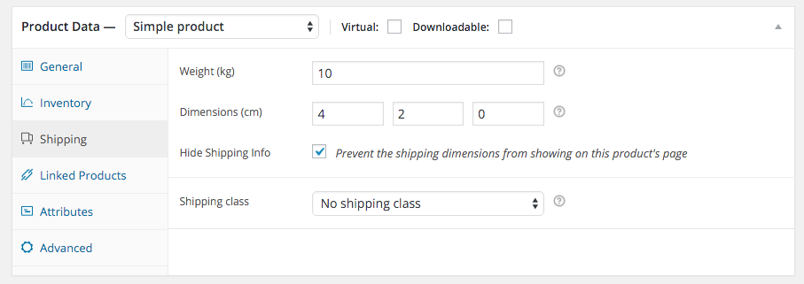
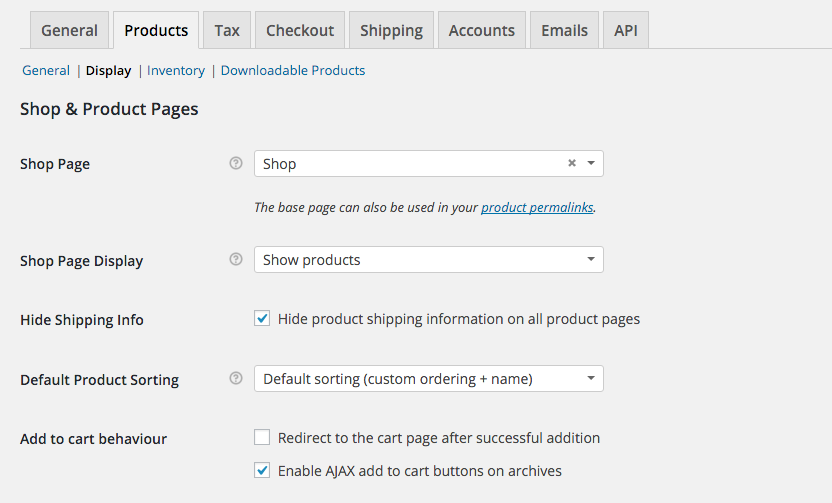

# Hide WooCommerce Product Shipping Information
This plugin gives you control over which products should display their shipping dimensions on the product pages. You can do this either on a per-product basis, or disable it once for all products. You are currently at the GitHub repository, where you can browse the source, look at open issues, and keep track of development.

## Documentation
### Disabling for an indivual product
In the WooCommerce products edit screen, there will be a new setting in the shipping tab called 'Hide Shipping Info'. Check this option to hide the shipping dimensions on the product page.

Product Settings:

### Disabling for all products
To hide the shipping information on all product pages, you can go **WooCommerce > Settings > Products > Display**. Here you will find the "Hide Shipping Info" option as well. Check this to keep the shipping dimensions from showing on all product pages.

Global Settings:

Shipping Information on a Product Page:

## Features

This plugin pretty much just does one thing, and hopefully it does it well. It is lightweight, and should not interfere or conflict with any other themes or plugins.

* Hide product shipping information on a per-product basis.
* Hide product shipping information for all products.

## Support
This repository is not suitable for support. Please don't use the issue tracker for support requests, but for plugin issues only. Support can take place in the WordPress.org forums.

## Contributing
If you have a patch, enhancement, or stumbled upon an issue - you can contribute this back to this plugin. Feel free to submit an issue or Pull Request!